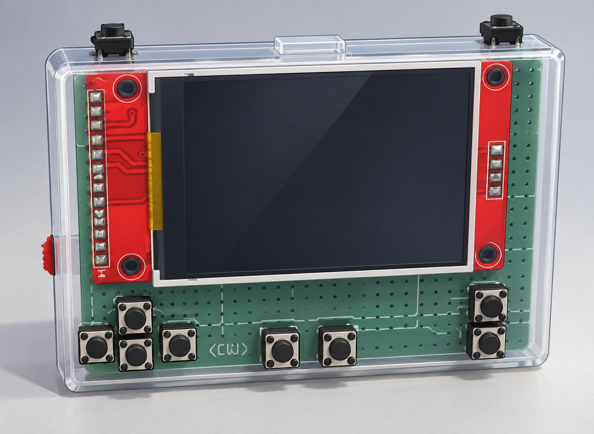

# PICO STATION

<p align="center">
  
</p>

<h1 align="center">PICO STATION</h1>

<p align="center">
  Una consola portátil DIY basada en Raspberry Pi Pico.
</p>

---

## Sobre el proyecto

**PICO STATION** es un proyecto de consola portátil creada utilizando hardware económico y componentes fáciles de conseguir.

El objetivo es construir una pequeña consola capaz de ejecutar diferentes juegos y proyectos desarrollados especialmente para este dispositivo.

### Características

- Raspberry Pi Pico
- Pantalla TFT
- Botones físicos
- Altavoces
- Batería recargable
- Almacenamiento para juegos
- Diseño portátil
- Hardware completamente DIY

---

## 🎮 Juegos

El sistema puede utilizar diferentes juegos y ports desarrollados específicamente para la PICO STATION.

Algunos de los proyectos incluyen:

- Minecraft
- Street Fighter
- Otros ports y juegos experimentales

---

## 🔧 Hardware

La consola está construida utilizando componentes electrónicos económicos:

| Componente | Función |
|---|---|
| Raspberry Pi Pico | Procesador principal |
| Pantalla TFT (ST7789) | Visualización |
| Botones | Entrada |
| Altavoz + transistor NPN | Audio |
| Batería Li-ion + módulo TP4056 | Alimentación |
| Tarjeta microSD | Almacenamiento de juegos y videos |
| PCB / Protoboard | Conexiones |

---

## 🔌 Conexiones

Todos los números **GP** son GPIO del RP2040 (no el número de pin físico). Los diagramas originales están en la carpeta [`conexiones/`](conexiones/).

> Se recomienda usar la **Raspberry Pi Pico original (RP2040)**, que es para la que está compilado el código.

### Pantalla TFT (ST7789, SPI0)

Diagrama: [`conexiones/display.png`](conexiones/display.png)

| Pantalla | GPIO | Pin físico Pico |
|---|---|---|
| VCC | VSYS | 39 |
| GND | GND | 23 (o cualquier GND) |
| SCL / SCK / CLK | GP18 | 24 |
| SDA / MOSI / DIN | GP19 | 25 |
| CS | GP17 | 22 |
| DC / A0 | GP20 | 26 |
| RES / RST | GP21 | 27 |
| BLK / BL | GP22 | 29 |

> Si tu módulo de pantalla funciona a 3,3 V, conecta VCC a **3V3 (pin 36)** en lugar de VSYS.

### Botones

Diagrama: [`conexiones/2.png`](conexiones/2.png)

Cada botón se conecta entre su GPIO y **GND** (el firmware activa el pull-up interno).

| Botón | Función en juego | GPIO | Pin físico Pico |
|---|---|---|---|
| UP | Avanzar | GP9 | 12 |
| DOWN | Retroceder | GP5 | 7 |
| LEFT | Girar a la izquierda | GP8 | 11 |
| RIGHT | Girar a la derecha | GP6 | 9 |
| STRAFE izquierda | Moverse de lado a la izquierda | GP10 | 14 |
| STRAFE derecha | Moverse de lado a la derecha | GP11 | 15 |
| START | Abrir puertas | GP4 | 6 |
| SELECT | Disparo | GP28 | 34 |
| B | Mirar arriba | GP3 | 5 |
| A | Mirar abajo | GP2 | 4 |

> Los botones STRAFE (GP10 y GP11) los usa el juego; el menú y el reproductor de video solo usan los otros ocho (definidos en `src/input.h`).

### Tarjeta SD (SPI1)

Configurada en `src/hw_config.c`.

| SD | GPIO | Pin físico Pico |
|---|---|---|
| MISO | GP12 | 16 |
| CS | GP13 | 17 |
| SCK | GP14 | 19 |
| MOSI | GP15 | 20 |
| VCC | 3V3 | 36 |
| GND | GND | cualquier GND |

### Audio (altavoz con transistor NPN)

Diagrama: [`conexiones/sound.png`](conexiones/sound.png)

| Desde | Hacia |
|---|---|
| GP7 (pin 10) | Resistencia de 1 kΩ → base del transistor |
| Emisor del transistor | GND |
| Colector del transistor | Terminal del altavoz |
| Otro terminal del altavoz | VBUS (pin 40, 5 V) |

Cuando no suena nada, GP7 queda en nivel bajo y el altavoz no consume corriente.

### Batería y alimentación

Diagrama: [`conexiones/baterry.png`](conexiones/baterry.png)

| Origen | Destino |
|---|---|
| Batería Li-ion (rojo) | B+ del TP4056 |
| Batería Li-ion (negro) | B− del TP4056 |
| OUT+ del TP4056 | Interruptor → VSYS (pin 39) |
| OUT− del TP4056 | GND de la Pico |

### Resumen de GPIO usados

| GPIO | Uso |
|---|---|
| GP2 | Botón A |
| GP3 | Botón B |
| GP4 | Botón START |
| GP5 | Botón DOWN |
| GP6 | Botón RIGHT |
| GP7 | Audio |
| GP8 | Botón LEFT |
| GP9 | Botón UP |
| GP10 | Botón STRAFE izquierda |
| GP11 | Botón STRAFE derecha |
| GP12 | SD MISO |
| GP13 | SD CS |
| GP14 | SD SCK |
| GP15 | SD MOSI |
| GP17 | Pantalla CS |
| GP18 | Pantalla SCK |
| GP19 | Pantalla MOSI |
| GP20 | Pantalla DC |
| GP21 | Pantalla RST |
| GP22 | Pantalla BL |
| GP28 | Botón SELECT |

---

## 📁 Estructura del proyecto

```text
pipicostation/
│
├── conexiones/     # Diagramas de cableado
│   ├── console.png
│   ├── display.png
│   ├── 2.png       # Botones
│   ├── sound.png
│   └── baterry.png
│
├── src/            # Código fuente (C, Pico SDK)
│
├── CMakeLists.txt
└── README.md
```
